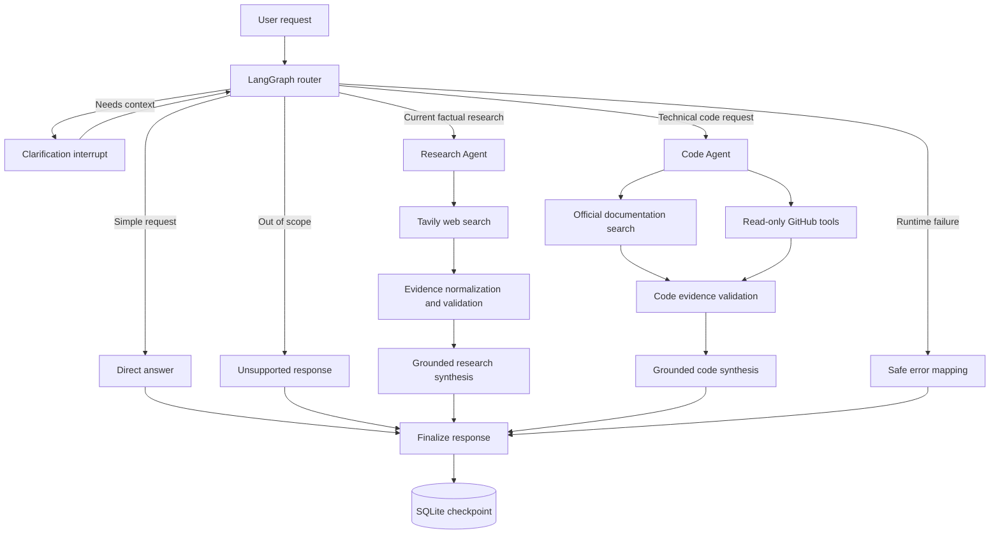

# AI Research Assistant

A complete local-first AI assistant for technical research, documentation analysis, GitHub discovery, and grounded code guidance. The application uses LangGraph to route each request to the appropriate workflow, Ollama for local inference, Tavily for web research, read-only GitHub tools for repository evidence, and SQLite for persistent conversation state.

The system is designed around verifiable evidence: research claims must reference validated source records, technical answers are synthesized from official documentation and public repository data, and unsupported output is rejected before it reaches the user.

## Features

- LangGraph request router with direct-answer, unsupported, research, code, clarification, and safe-error paths.
- Research Agent that searches the web, prioritizes relevant evidence, and produces claim-level source attribution.
- Code Agent that searches official documentation and public GitHub resources for grounded examples.
- Read-only GitHub tools for repository search, README retrieval, release discovery, and authenticated code search.
- Trusted-domain allowlists for official documentation search.
- Stable evidence IDs, exact supporting quotes, source deduplication, and schema validation.
- SQLite conversation checkpointing with isolated `thread_id` sessions.
- Human-in-the-Loop clarification using LangGraph interrupts and resume commands.
- English and Ukrainian response handling.
- Localized, safe failures for missing configuration, unavailable providers, and invalid model output.
- Strictly typed Pydantic models and comprehensive unit and integration tests.

## Architecture



## Request Routing

| Route | Purpose |
| --- | --- |
| `direct_answer` | Handles simple conversational requests that do not require external evidence |
| `research` | Searches current web sources and returns a grounded research response |
| `code` | Produces evidence-backed technical guidance and code examples |
| `clarification` | Pauses execution when the request is ambiguous and resumes in the same thread |
| `unsupported` | Explains that the request is outside the assistant's supported scope |
| `route_unavailable` | Handles recognized but unavailable routes safely |
| `error` | Converts expected provider or model failures into user-safe responses |

## Technology Stack

| Component | Technology |
| --- | --- |
| Workflow orchestration | LangGraph |
| Agent framework | LangChain |
| Local inference | Ollama |
| Web research | Tavily Search API |
| Repository research | GitHub REST API |
| Persistence | SQLite LangGraph checkpointer |
| Validation and settings | Pydantic, Pydantic Settings |
| HTTP client | HTTPX |
| Testing | pytest |
| Code quality | Ruff, mypy |

## Project Structure

```text
langgraph-ai-research-assistant/
├── scripts/                         # Live smoke tests for agents and providers
├── src/ai_research_assistant/
│   ├── agents/
│   │   ├── code/                    # Code Agent, prompts, evidence, and validation
│   │   └── research/                # Research Agent, prompts, evidence, and validation
│   ├── graph/                       # State, nodes, router, and graph builder
│   ├── memory/                      # Managed SQLite checkpointing
│   ├── tools/                       # Tavily, documentation, and GitHub adapters
│   ├── config.py                    # Environment-based settings
│   ├── conversation.py              # Bounded conversation context
│   ├── errors.py                    # Safe runtime error mapping
│   ├── llm.py                       # Ollama chat model factory
│   └── models.py                    # Typed routing, evidence, and result contracts
├── tests/
│   ├── integration/                 # Graph, persistence, and clarification tests
│   └── unit/                        # Agent, tool, model, and context tests
├── .env.example
└── pyproject.toml
```

## Prerequisites

- Python 3.11 or newer
- Git
- [Ollama](https://ollama.com/)
- A Tavily API key for research and documentation search
- An optional GitHub token for authenticated code search

## Installation

Clone the repository and enter the project directory:

```bash
git clone https://github.com/Yon1k3/langgraph-ai-research-assistant.git
cd langgraph-ai-research-assistant
```

Create and activate a virtual environment:

```bash
python -m venv .venv
source .venv/bin/activate
```

On Windows PowerShell:

```powershell
python -m venv .venv
.\.venv\Scripts\Activate.ps1
```

Install the project with development dependencies:

```bash
python -m pip install --upgrade pip
pip install -e ".[dev]"
cp .env.example .env
```

On Windows PowerShell, use `Copy-Item .env.example .env` instead of `cp`.

Download the configured Ollama model:

```bash
ollama pull llama3.1:8b
```

## Configuration

Update `.env` with the required provider settings:

```env
OLLAMA_MODEL=llama3.1:8b
OLLAMA_BASE_URL=http://localhost:11434
WEB_SEARCH_API_KEY=your_tavily_api_key
GITHUB_TOKEN=your_optional_read_only_token
CHECKPOINT_DB_PATH=data/checkpoints.sqlite3
```

| Variable | Required | Description |
| --- | --- | --- |
| `OLLAMA_MODEL` | No | Ollama model used for routing, agents, and synthesis |
| `OLLAMA_BASE_URL` | No | Ollama server URL |
| `WEB_SEARCH_API_KEY` | Yes for research | Tavily API key used by web and documentation search |
| `GITHUB_TOKEN` | No | Enables authenticated GitHub code search and increases API limits |
| `CHECKPOINT_DB_PATH` | No | SQLite database used for conversation checkpoints |

The GitHub integration is read-only. Repository search, README retrieval, and release discovery can use public endpoints without a token; GitHub code search requires `GITHUB_TOKEN`.

## Usage

The package exposes a managed application graph that owns and closes its SQLite checkpointer:

```python
from ai_research_assistant.graph import open_app_graph

config = {"configurable": {"thread_id": "demo-thread"}}

with open_app_graph() as graph:
    result = graph.invoke(
        {
            "messages": [
                {
                    "role": "user",
                    "content": "Explain the current purpose of LangGraph and cite official sources.",
                }
            ]
        },
        config=config,
    )

    print(result["messages"][-1].content)
```

Use the same `thread_id` for follow-up questions so LangGraph can restore the conversation state from SQLite. Different thread IDs remain isolated.

### Human-in-the-Loop Clarification

When the router needs more information, the graph pauses with a clarification interrupt. Resume the same checkpointed thread with a LangGraph `Command`:

```python
from langgraph.types import Command

result = graph.invoke(
    Command(resume="Focus on the Python implementation."),
    config=config,
)
```

The clarification answer is appended to the conversation and routed again without losing earlier context.

## Verification

Run the complete automated test suite:

```bash
pytest
```

Run static checks:

```bash
ruff check src tests
ruff format --check src tests
mypy src
```

The repository also includes live smoke tests. These require Ollama and, depending on the script, configured external providers:

```bash
python scripts/smoke_test_ollama.py
python scripts/smoke_test_search.py
python scripts/smoke_test_source_tools.py
python scripts/smoke_test_research_agent.py
python scripts/smoke_test_code_agent.py
python scripts/smoke_test_router.py
python scripts/smoke_test_conversation_context.py
python scripts/smoke_test_clarification.py
```

## Evidence and Safety Guarantees

- Research claims must resolve to a known evidence ID.
- Supporting quotes are checked against the selected source content.
- Unrelated, duplicated, malformed, or unknown evidence is excluded.
- Official documentation searches enforce an explicit domain allowlist.
- GitHub tools expose read-only operations only.
- Code answers must contain the requested operations and imports supported by evidence.
- Generated code is returned as guidance and is never executed by the Code Agent.
- Expected provider and model failures are converted into localized user-safe messages.
- Programming errors are not silently hidden by runtime fallback handling.
- Secrets are loaded from `.env` and excluded from version control.

## Supported Use Cases

- Researching current technical capabilities, releases, and limitations.
- Comparing documented behavior across official sources.
- Finding public GitHub repositories and release information.
- Reading repository documentation and, with authentication, searching public code.
- Producing grounded Python examples for libraries and APIs.
- Continuing multi-turn research in persistent, isolated conversation threads.

## Scope and Limitations

- Research and documentation search require a Tavily API key.
- The assistant uses Ollama as its configured language-model provider.
- GitHub code search requires an optional token; other GitHub tools work with public API limits.
- Generated code is validated structurally but is not executed.
- The repository provides the agent package, graph, tests, and smoke-test entry points; it does not include a web UI.

## Security

Store secrets only in the local `.env` file and never commit it. The checkpoint database, virtual environments, caches, logs, and other generated runtime data are excluded through `.gitignore`.
